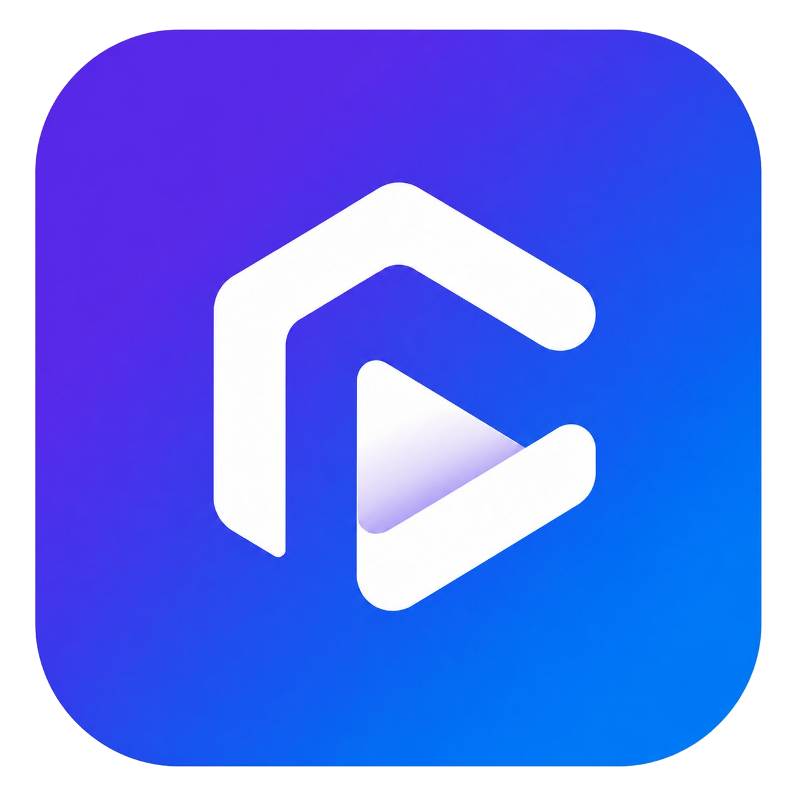
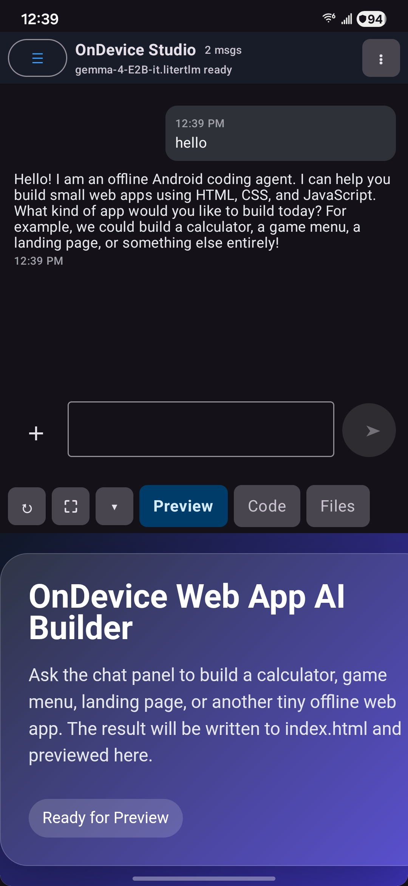
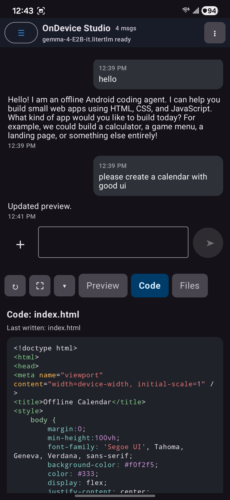
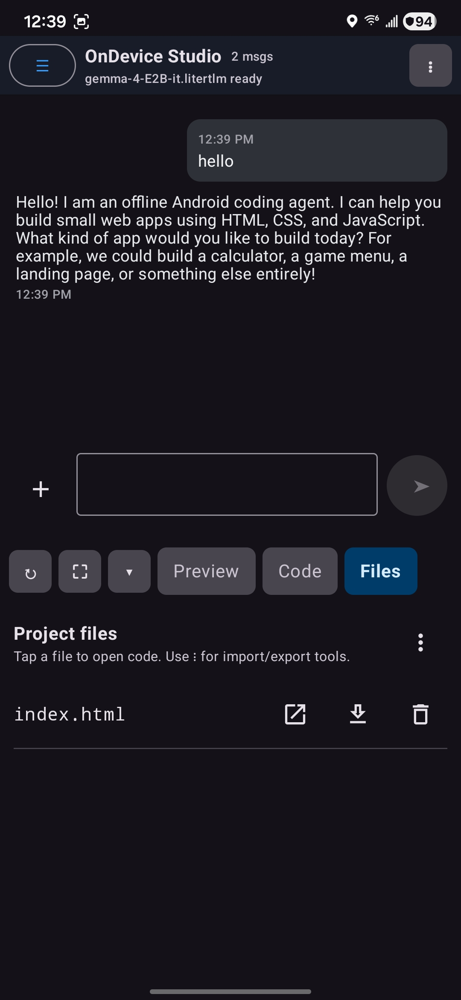
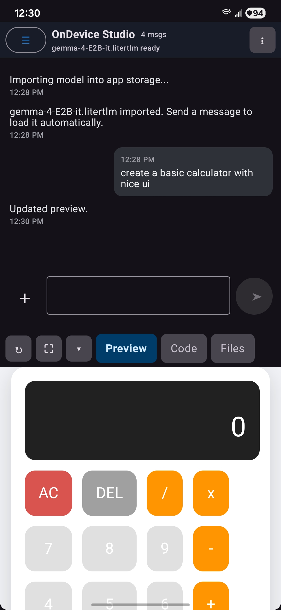
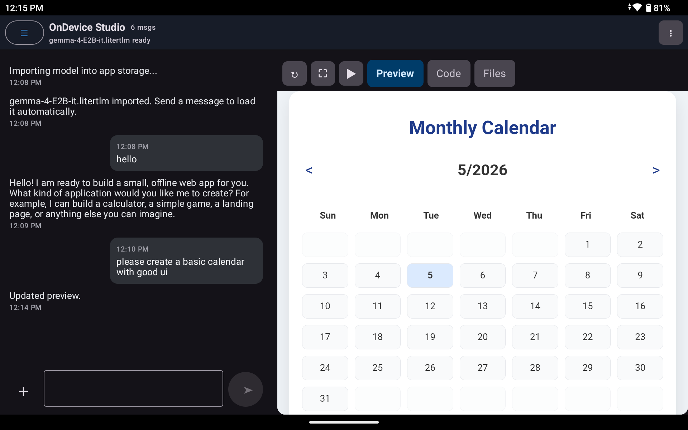

  

<h1 align="center">OnDevice Studio</h1>

  OnDevice Studio is an Android app that helps you build and preview web apps (HTML/CSS/JS) directly on your device using local AI workflows.
  Import a compatible .litertlm model, generate with prompts, iterate fast in live preview, and export your project when ready.

## App Features

- Build simple web apps from prompts directly on Android
- Live preview your generated app instantly
- Edit and iterate with chat-style prompts
- Import model files and run generation on-device
- Import project files and export your work as ZIP
- Keep your generated files inside app-local storage by default

## Screenshots

  
  

  
  

  

## Device Requirements

Minimum (app + basic usage):
- Android 12 or newer
- 6 GB RAM
- 4 GB free storage for app, workspace, and model files

Recommended (comfortable local model experience):
- Android 13 or newer
- 8 GB RAM or more
- Mid-range to flagship processor
- 4-6 GB free storage (depending on model size and project assets)

Notes:
- Larger `.litertlm` models need more RAM and storage.
- First model load can take longer; later runs are usually faster.

## Installing

1. Go to the GitHub **Releases** page.
2. Download the latest APK from the most recent release.
3. Open the APK on your Android device and install it.
4. Launch **OnDevice Studio**.

## Using the App

1. Open OnDevice Studio on your device.
2. Import a compatible `.litertlm` model from the menu.
Model setup: This repository does **not** include model files, so download one first and then import it in-app.
Recommended model family: `litert-community/gemma-4-E2B-it.litertlm`
Model source: [Hugging Face - litert-community/gemma-4-E2B-it-litert-lm](https://huggingface.co/litert-community/gemma-4-E2B-it-litert-lm/tree/main)
3. Enter a prompt (example: `Build a calculator app with a clean UI`).
4. Generate and review the live preview.
5. Refine with follow-up prompts.
6. Export files when you are ready.

## Security and Privacy Notes

- Generated project files stay inside app-private storage by default.
- External web navigation is restricted in preview flow.
- Imported files/models are handled locally on-device.

## Development

### Tech Stack

- Kotlin
- Jetpack Compose (Material 3)
- Android WebView
- LiteRT-LM Android runtime
- ML Kit (OCR / labeling helpers)

### Requirements

- Android Studio (recent stable)
- JDK 17+
- Android SDK matching project config

### Project Structure

- `app/src/main/java/com/nikunj/gemmabuilder/` - main app source
- `app/src/main/res/` - Android resources
- `app/src/main/AndroidManifest.xml` - app manifest
- `app/build.gradle.kts` - app module build config

### Build Notes

Current app version:

- `versionName`: `1.0.5`
- `versionCode`: `1`

LiteRT-LM dependency is pinned in app Gradle config. If your environment needs it, you can switch to `latest.release`.

## License

This project is licensed under the MIT License. See [LICENSE](LICENSE) for details.
